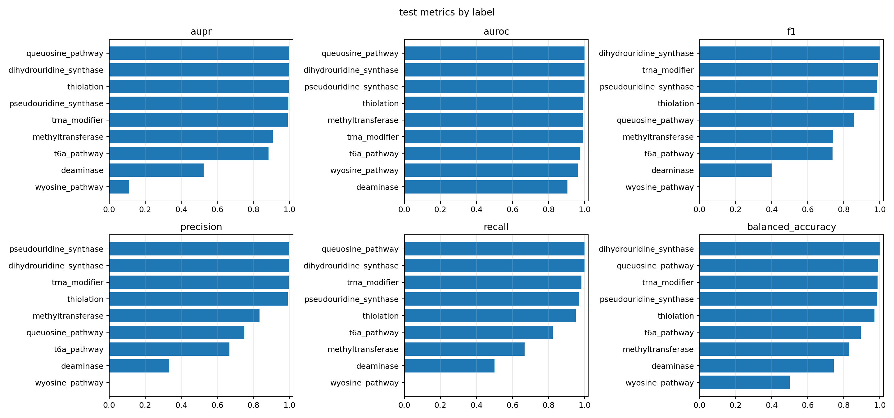
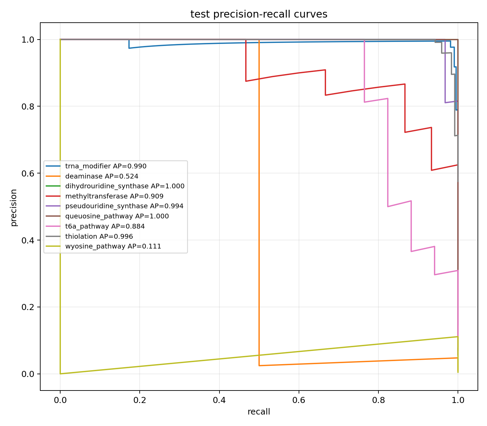
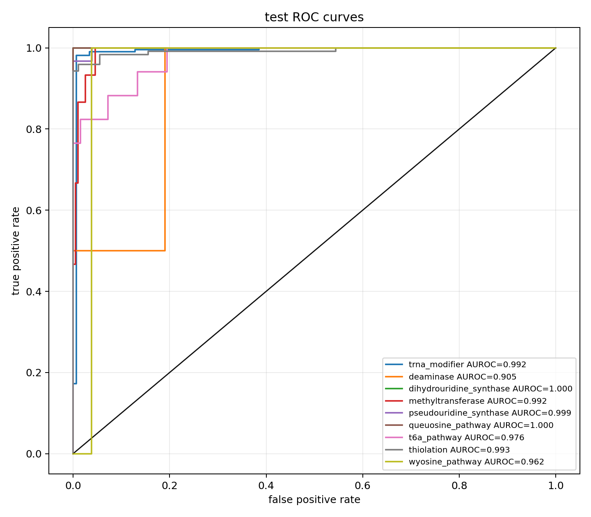
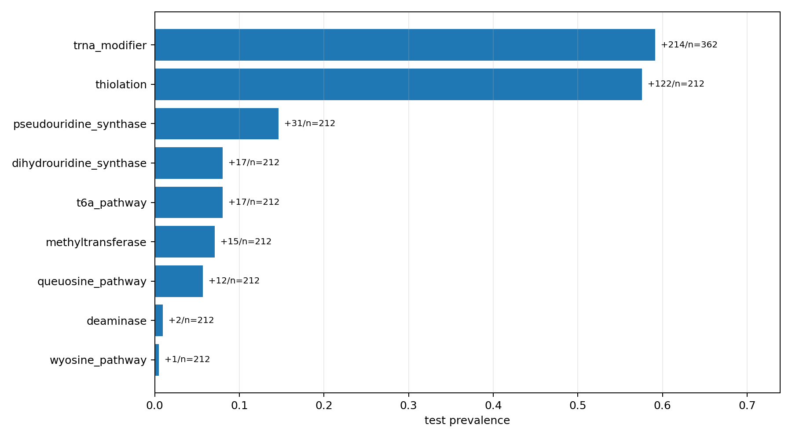

# tRNA Modification Protein Prediction Dataset Pipeline

This repository builds a curated, evidence-aware benchmark dataset for training
machine learning models to predict RNA and especially tRNA modification
proteins. It is designed for bacterial, phage, prophage, and mobile-element
contexts.

The current deliverable is dataset construction: source download, source
normalization, label assignment, train/test policy fields, sequence FASTA
generation, and an auditable dataset card.

For a lightweight proof of concept, this repository also includes a simpler
MODOMICS-only path: retrieve curated tRNA-modification proteins, use MODOMICS
enzyme type as the prediction label, and train a small classifier from frozen
protein embeddings.

## What Is Tracked

Tracked:

- source code in `src/rnmod/`
- ordered pipeline scripts in numbered folders under `scripts/`
- Snakemake workflow in `workflow/Snakefile`
- configuration in `configs/`
- conda environments
- tests
- small manual curation tables in `data/manual/`

Ignored and regenerated:

- `data/raw/`
- `data/interim/`
- `data/processed/`
- `.snakemake/`
- `logs/`

## Quick Start

From the repository root:

```bash
conda env create -f environment.yml
conda activate ML_RNA_mod
scripts/01_pipeline/01_run_pipeline.sh
```

Validate generated outputs:

```bash
python scripts/02_validation/02_validate_outputs.py --config configs/config.yaml
```

## Simple POC Workflow

Use this path when the goal is only to prove that curated tRNA-modifier labels
can be learned from protein embeddings.

Build the MODOMICS tRNA protein dataset:

```bash
python scripts/03_poc/01_build_modomics_trna_dataset.py
```

This writes:

```text
data/processed/poc/modomics_trna_proteins.tsv
data/processed/poc/modomics_trna_sequences.faa
data/processed/poc/modomics_trna_label_matrix.tsv
data/processed/poc/modomics_trna_dataset_card.md
```

Then generate ESM3 embeddings for the FASTA sequences with your preferred
embedding script. Save one `.pt` or `.npy` file per UniProt accession, for
example:

```text
P53088_hidden_layer_steps10.pt
Q58428_hidden_layer_steps10.pt
```

Loading `.pt` embeddings requires `torch`; `.npy` embeddings only require NumPy.

Train the proof-of-concept classifier:

```bash
python scripts/03_poc/02_train_embedding_logreg.py \
  --embedding-dir path/to/esm3_embeddings \
  --output-dir data/processed/poc/ml_runs \
  --run-name modomics_trna_logreg
```

The trainer mean-pools each embedding and fits one-vs-rest logistic-regression
models for MODOMICS enzyme-type labels with cross-validation.

## Weak-Label UniProt POC Workflow

Use this path when you want a larger no-manual-curation proof of concept before
committing to curated database expansion. It combines MODOMICS tRNA anchors with
automated reviewed-UniProt text-query positives and reviewed non-tRNA controls.

Build the default small weak-label dataset:

```bash
python scripts/03_poc/03_build_weak_uniprot_trna_dataset.py
```

The default `small` profile caps live UniProt query results and focuses the
weak-label expansion on bacteria/archaea so the first embedding run stays
manageable. Larger runs are available with:

```bash
python scripts/03_poc/03_build_weak_uniprot_trna_dataset.py --profile standard
python scripts/03_poc/03_build_weak_uniprot_trna_dataset.py --profile full
```

This writes:

```text
data/processed/poc_weak/weak_trna_mod_proteins.tsv
data/processed/poc_weak/weak_trna_mod_sequences.faa
data/processed/poc_weak/weak_trna_mod_label_matrix.tsv
data/processed/poc_weak/weak_trna_mod_dataset_card.md
```

Primary label:

```text
target__trna_modifier
```

Optional broad mechanism labels are emitted as `mechanism__...` columns. These
labels are weak and should be evaluated with cluster-heldout splits before being
interpreted.

Create cluster-heldout splits:

```bash
python scripts/03_poc/04_cluster_split_sequences.py
```

This writes:

```text
data/processed/poc_weak/splits/mmseqs50/cluster_membership.tsv
data/processed/poc_weak/splits/mmseqs50/cluster_assignments.tsv
data/processed/poc_weak/splits/mmseqs50/split_assignments.tsv
data/processed/poc_weak/splits/mmseqs50/split_summary.tsv
data/processed/poc_weak/splits/mmseqs50/cluster_split_card.md
```

After generating embeddings for `weak_trna_mod_sequences.faa`, train the first
binary classifier:

```bash
python scripts/03_poc/05_train_weak_embedding_logreg.py \
  --embedding-dir path/to/embeddings \
  --task binary
```

For the recommended high-quality GPU embedding run with ESM-C 6B, use:

```bash
python scripts/03_poc/06_embed_sequences_esmc.py \
  --fasta data/processed/poc_weak/weak_trna_mod_sequences.faa \
  --output-dir data/processed/poc_weak/embeddings/esmc_6b \
  --model-name biohub/ESMC-6B \
  --max-tokens-per-batch 4096 \
  --device-map auto \
  --device cuda
```

On Bridges/Slurm, see `docs/POC_ESMC_BRIDGES.md` and
`scripts/03_poc/bridges_esmc_embed.sbatch`.

## Current ESM-C Weak-Label Results

The current proof-of-concept run uses frozen, mean-pooled ESM-C 6B embeddings
for the weak-label UniProt/MODOMICS dataset. The robust model pipeline is in
`scripts/03_poc/08_train_weak_embedding_robust_models.py`; it selects
regularization on validation AUPR, selects classification thresholds on
validation F1, refits each selected model on train+validation, and evaluates
once on the held-out test split.

The final run is stored under:

```text
data/processed/poc_weak/ml_runs/esmc6b_robust_logreg/
```

Key audit facts:

- Embedded proteins: `2411`
- Split sizes: `1687` train, `362` validation, `362` test
- Cluster split leakage: `False`
- Duplicate accessions: `0`
- Duplicate embedding groups spanning splits: `0`
- Model artifacts: one `.joblib` classifier per included label

Label scope matters. The binary `trna_modifier` classifier uses all trainable
rows. Mechanism classifiers use only `mechanism_labeled` tRNA-modifier rows, so
unrelated non-tRNA proteins are not counted as mechanism negatives.

Aggregate held-out performance:

| Family | Labels | Test micro AUPR | Test micro AUROC | Test macro AUPR | Test macro AUROC | Test macro F1 |
|---|---:|---:|---:|---:|---:|---:|
| Binary `trna_modifier` | 1 | 0.990 | 0.992 | 0.990 | 0.992 | 0.988 |
| Mechanism one-vs-rest | 8 | 0.955 | 0.973 | 0.802 | 0.978 | 0.711 |

Held-out test metrics by label:

| Label | Positives | AUPR | AUROC | Precision | Recall | F1 | Balanced Accuracy |
|---|---:|---:|---:|---:|---:|---:|---:|
| `trna_modifier` | 214 | 0.990 | 0.992 | 0.995 | 0.981 | 0.988 | 0.987 |
| `deaminase` | 2 | 0.524 | 0.905 | 0.333 | 0.500 | 0.400 | 0.745 |
| `dihydrouridine_synthase` | 17 | 1.000 | 1.000 | 1.000 | 1.000 | 1.000 | 1.000 |
| `methyltransferase` | 15 | 0.909 | 0.992 | 0.833 | 0.667 | 0.741 | 0.828 |
| `pseudouridine_synthase` | 31 | 0.994 | 0.999 | 1.000 | 0.968 | 0.984 | 0.984 |
| `queuosine_pathway` | 12 | 1.000 | 1.000 | 0.750 | 1.000 | 0.857 | 0.990 |
| `t6a_pathway` | 17 | 0.884 | 0.976 | 0.667 | 0.824 | 0.737 | 0.894 |
| `thiolation` | 122 | 0.996 | 0.993 | 0.991 | 0.951 | 0.971 | 0.970 |
| `wyosine_pathway` | 1 | 0.111 | 0.962 | 0.000 | 0.000 | 0.000 | 0.500 |

`acetyltransferase` was skipped because it had only 2 training positives and 0
test positives. `deaminase`, `dihydrouridine_synthase`, and `wyosine_pathway`
have very low validation and/or test positive counts, so their threshold-based
metrics should be treated as exploratory. High AUROC with one or two positives
is not enough to claim a robust classifier; AUPR, precision/recall, and positive
counts are more informative for these rare mechanisms.

### Figures

The metric bars summarize the held-out test behavior across labels. They make
the core pattern clear: the binary task is very strong, common mechanism labels
such as thiolation and pseudouridine synthase are strong, and rare labels remain
unstable.



Precision-recall curves are the most useful view for these imbalanced labels.
The mechanism micro-AUPR is high, but the macro-AUPR is lower because rare labels
such as deaminase and wyosine pathway have too few positives for stable
thresholding.



ROC curves look strong for most labels, but they can be optimistic under severe
class imbalance. Interpret them alongside AUPR and the label-prevalence plot.



The prevalence plot is the guardrail for interpretation: labels with very small
test positive counts can produce impressive-looking rank metrics while still
being biologically underpowered.



The short audit report is tracked at
`data/processed/poc_weak/ml_runs/esmc6b_robust_logreg/audit_summary.md`.

## Pipeline Order

1. `scripts/00_data_download/00_download_sources.py` downloads configured public raw sources.
2. Snakemake ingests each source into `data/interim/`.
3. `rnmod build-master` merges normalized records into processed model-ready outputs.
4. `scripts/02_validation/02_validate_outputs.py` checks final outputs.

Main generated outputs:

```text
data/processed/rnmod_master.parquet
data/processed/rnmod_master.tsv.gz
data/processed/rnmod_sequences.faa
data/processed/rnmod_label_matrix.parquet
data/processed/source_manifest.tsv
data/processed/rnmod_dataset_card.md
```

## Configuration

Edit `configs/config.yaml` for routine changes:

- source enable/disable flags
- public source URLs
- raw/interim/processed output paths
- legacy pilot input paths or URLs
- dataset behavior flags

No default config path points outside this repository.

## Label Policy

Use `gold_positive` and `silver_positive` records as positives. Use only curated
`hard_negative` rows as negatives. Keep `bronze_candidate` as candidate-only.
Exclude `unknown`, `conflicted`, fragmentary, hypothetical, and
sequence-missing records from supervised training.

Unknown, hypothetical, fragmentary, conflicted, and unlabeled proteins are never
used as hard negatives.

## Manual Curation Inputs

Tracked manual source tables:

```text
data/manual/literature_seeds.tsv
data/manual/modomics_import.tsv
data/manual/ecocyc_import.tsv
```

These are intentionally small and auditable. Larger public datasets are
downloaded or regenerated by the pipeline.

See `docs/REPRODUCIBILITY.md` for the full data and audit policy.
